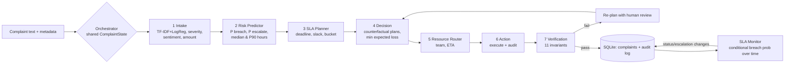

# Multi-Agent Decision Intelligence Framework for Predictive Customer Complaint Management and SLA-Aware Resolution

Backend-only implementation (no frontend). It evolves the hackathon prototype *NivaaranAI* from a
**reactive, rule-based pipeline** into a **predictive, decision-theoretic multi-agent system**:

| Topic keyword | What implements it |
|---|---|
| **Predictive** | Real ML models trained on held-out-evaluated data: SLA-breach probability (3-model ensemble), resolution-time forecast with P90 interval, customer-escalation risk, and a TF-IDF/LogReg intake classifier |
| **Multi-agent** | 7 agents (Intake, Risk Predictor, SLA Planner, Decision, Resource Router, Action, Verification) + an SLA Monitor, coordinated by an orchestrator over a shared state, with traces, audit log, re-planning and safe fallbacks |
| **Decision intelligence** | The Decision agent re-queries the trained models *counterfactually* ("what if we fast-track / reroute?") and picks the plan with minimum expected loss `P(breach) x penalty x tier + cost` |
| **SLA-aware** | Severity-based deadlines, predicted slack vs. P90, risk buckets, and a monitor that re-scores open cases as the clock advances using the conditional log-normal survival probability |

## Quick start

```bash
pip install -r requirements.txt
make all        # generate data -> train + evaluate -> policy simulation   (~4 min)
make demo       # readable agent trace for 5 sample complaints + SLA monitor sweeps
make test       # 38 unit tests (python -m unittest; pytest also works)
make serve      # optional FastAPI layer -> http://localhost:8000/docs
```
Pre-generated artifacts are included (`data/`, `models/`, `reports/`), so `make demo` works immediately.

## Architecture



### Agents
| Agent | Responsibility | ML / logic |
|---|---|---|
| Intake | product, issue, route, severity, sentiment, amount, repeat history | TF-IDF + LogReg with hierarchical decoding (issue constrained to predicted product); confidence < 0.40 -> human triage |
| Risk Predictor | P(breach), P(escalation), median & P90 resolution time | Ensemble (GB + LR + log-normal), GB regressor on log-hours; falls back to rules if models fail |
| SLA Planner | deadline, slack vs P90, risk bucket, watch checkpoints at 50% / 80% | deterministic |
| Decision | choose standard / fast-track / reroute / both; priority score; escalation level | counterfactual model queries + expected-loss minimisation (`config.py` holds penalties/costs) |
| Resource Router | owning team (primary or backup), partner, ETA | live or simulated team load |
| Action | executes taxonomy + intervention actions (simulated connectors), writes append-only audit log | kill switch; **never auto-acts on low-confidence classification** |
| Verification | 10 invariant checks (valid route, probabilities, deadline, status/route consistency, audit trail, intervention not harmful, critical-risk escalation...) | failed -> orchestrator re-plans once with human review |
| SLA Monitor | re-scores open cases: `P(T>SLA \| T>elapsed) = S(SLA)/S(elapsed)`; flags At Risk / Breached and escalates | log-normal survival |

## Results (held-out chronological test, 1,350 complaints; full tables in `reports/RESULTS.md`)

| Component | Result | Baseline |
|---|---|---|
| SLA-breach prediction (ROC-AUC) | **0.913** (ensemble) | static rule 0.839 |
| Top-20% riskiest flagged | captures **67%** of breaches (3.3x lift) | - |
| Resolution-time forecast | MAE 39.3 h, R2(log) 0.914; **P90 coverage 89.8%** (nominal 90%) | route x severity median: MAE 46.2 h |
| Customer-escalation risk (ROC-AUC) | 0.69 (GB) / 0.71 (LR) | - |
| Intake accuracy (issue, 161 classes) | **95.8%** | hackathon keyword matcher 44% |

**Policy simulation** (same complaints, same latent noise, real pipeline incl. ML intake errors):

| Policy | SLA breach rate | Fast-tracks / reroutes | Net loss* |
|---|---|---|---|
| No intervention | 22.1% | 0 / 0 | 1618.2 |
| Static rule (fast-track every High/Critical) | 15.9% | 318 / 0 | 1186.9 |
| **Predictive multi-agent** | **12.5%** | 431 / 75 | **1115** |

\*net loss = breach penalties + intervention costs. Predictive vs. no intervention: **-31% net loss (95% CI 24-37%)**, 129 breaches avoided.
Predictive vs. static rule: **-6.0% (95% CI 1.6-10.7%)**, 46 fewer breaches.

## Honest limitations (please read before presenting)

1. **The data is synthetic.** The hackathon project had no labelled history of resolution times or SLA outcomes, so
   `cdi/data/synthetic.py` simulates a complaint desk with a documented causal process. Every number above shows the
   framework works *as designed on that process*; it is **not** a claim about real-bank performance. With real
   history you replace one CSV and re-run `make train`.
2. **Simulation effects are assumptions.** Policy outcomes come from the same structural world model that generated
   the data (fast-track x0.65, rerouting overhead, load effect). The models learn these effects from data, and the
   comparison uses common random numbers and bootstrap CIs, but the simulator cannot validate that real fast-tracking
   behaves this way.
3. **Logistic regression alone is slightly better than the ensemble on this data** (AUC 0.916 vs 0.913), because the
   synthetic process is log-linear. The ensemble was chosen on the *validation* split for robustness, and all members
   are reported in `RESULTS.md`. Escalation risk is also a weaker signal (AUC ~0.7).
4. **Critical/High cases:** the predictive policy is on par with the static rule there (24.9% vs 24.3% breach). Its
   gain comes from spending interventions more selectively across all severities and using rerouting, at a higher
   total intervention cost (net loss accounts for this).
5. **Intake accuracy is on templated synthetic text**, and the keyword baseline was built for different phrasing, so
   that comparison is not like-for-like. Real complaints will be harder.
6. **Action connectors are simulated** (audited, no real core-banking calls). Severity rules (`severity.py`) are a
   hand-written approximation because the old severity table only covered 8 of 161 issues.
7. The FastAPI wrapper (`cdi/api/app.py`) could not be executed in the build sandbox (FastAPI not installable
   offline). All logic it calls lives in `cdi/service.py`, which **is** unit-tested.

## Project layout
```
src/cdi/
  config.py  taxonomy.py  severity.py  nlp.py  service.py  cli.py
  data/        action_lookup.py (reused from hackathon), synthetic.py (generator + world model + load model)
  ml/          features.py  risk_models.py  intake_model.py
  agents/      base.py intake.py risk.py sla.py decision.py router.py action.py verifier.py monitor.py
  orchestrator/ state.py  pipeline.py
  store/       sqlite_store.py        (complaints + append-only audit log)
  evaluation/  metrics.py  simulate.py  report.py
  baselines/   keyword_classifier.py  (hackathon classifier, kept only as a baseline)
  api/         app.py                 (optional FastAPI wrapper)
tests/         38 tests: NLP, taxonomy, generator, models, agents, replanning, monitor, service
data/ models/ reports/                 pre-generated artifacts (CSV, joblib, metrics, figures, sample traces)
```

## Suggested demo for the evaluator (about 5 minutes)
1. `make demo` - walk through one complaint's trace: intake -> forecast -> SLA plan -> *counterfactual decision with rationale* -> routing -> actions -> verification.
2. Show the last demo case: low-confidence text goes to human triage and triggers **no** automated action.
3. Show the SLA monitor sweep: cases flip On Track -> At Risk -> Breached and escalate as simulated time advances.
4. Open `reports/RESULTS.md` and `reports/figures/`: model metrics vs baselines, calibration, policy comparison.
5. `reports/sample_traces.json`: full JSON decision traces (biggest wins, a human-review case, an auto-resolve case).
6. `make test`.

## Reused from the hackathon project
`action_lookup.py` (161-issue taxonomy with routes/actions), the multi-agent idea and agent names, the severity/SLA-day
concept, and the keyword classifier (as a benchmark baseline). Dropped: frontend, MongoDB, FAISS/LLM stack, e-mail ingestion.
