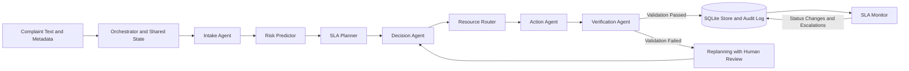

# Multi-Agent Decision Intelligence Framework for Predictive Customer Complaint Management and SLA-Aware Resolution

A backend-only, ML-powered multi-agent system for predictive customer complaint management, intelligent intervention planning, and Service Level Agreement (SLA) monitoring.

The framework combines trained machine learning models, specialized agents, counterfactual decision-making, and continuous monitoring to improve complaint handling in a simulated financial services environment.

## Key Features

| Topic | Implementation |
|---|---|
| **Predictive Analytics** | ML models for SLA-breach probability, resolution-time forecasting with P90 intervals, customer-escalation risk, and complaint classification using TF-IDF and Logistic Regression. |
| **Multi-Agent Architecture** | Seven specialized agents, an SLA Monitor, and an orchestrator coordinating shared complaint state, execution traces, audit logs, replanning, and safe fallbacks. |
| **Decision Intelligence** | Counterfactual evaluation of interventions such as fast-tracking and rerouting, selecting plans that minimize expected loss. |
| **SLA Awareness** | Severity-based deadlines, predicted resolution slack, risk categories, monitoring checkpoints, and time-dependent breach-risk reassessment. |
| **Safety and Verification** | Classification-confidence thresholds, human-review routing, intervention validation, audit logging, and fallback handling. |
| **Evaluation** | Chronological held-out evaluation, baseline comparisons, policy simulation, bootstrap confidence intervals, and automated tests. |

## Quick Start

### Requirements

- Python installed.
- Dependencies listed in `requirements.txt`.
- GNU Make or a compatible alternative for running the provided Makefile commands.

### Installation

```bash
pip install -r requirements.txt
```

### Run the Project

```bash
make all        # Generate data, train and evaluate models, simulate policies
make demo       # Run sample complaints and SLA monitor sweeps
make test       # Run the unit tests
make serve      # Start the optional FastAPI service
```

The complete build takes approximately four minutes, depending on the environment.

Pre-generated artifacts are included in `data/`, `models/`, and `reports/`, allowing the demo to run without retraining, provided the required dependencies and artifacts are available.

The optional API documentation is available at:

`http://localhost:8000/docs`

## Architecture



The orchestrator coordinates the workflow through a shared complaint state. Each agent performs a specialized task and records relevant decisions, predictions, or actions. Failed verification can trigger a replanning attempt with human review.

The SQLite store maintains complaint records and an append-only audit log. The SLA Monitor periodically reassesses unresolved cases as simulated time advances.

## Agent Responsibilities

| Agent | Responsibility | ML or Logic |
|---|---|---|
| **Intake Agent** | Extracts product, issue, severity, route, sentiment, transaction amount, and repeat history. | TF-IDF and Logistic Regression with hierarchical classification. Confidence below 0.40 triggers human triage. |
| **Risk Predictor** | Estimates SLA-breach probability, customer-escalation probability, and median/P90 resolution time. | Gradient Boosting, Logistic Regression, and log-normal modelling, with fallback rules. |
| **SLA Planner** | Calculates deadlines, remaining time, resolution slack, risk categories, and monitoring checkpoints. | Deterministic SLA planning logic. |
| **Decision Agent** | Evaluates candidate interventions and selects a plan with minimum expected loss. | Counterfactual model queries and expected-loss minimization. |
| **Resource Router** | Assigns the responsible team, backup team or partner, and estimated completion time. | Simulated team-load and routing logic. |
| **Action Agent** | Executes simulated resolution, escalation, and intervention actions. | Taxonomy-based actions, audit logging, and a kill switch. Low-confidence cases are never automatically acted upon. |
| **Verification Agent** | Checks route validity, probability ranges, deadlines, status consistency, audit records, intervention impact, and escalation requirements. | Invariant-based validation. Failed verification triggers replanning with human review. |
| **SLA Monitor** | Reassesses unresolved complaints and identifies At Risk or Breached cases. | Conditional log-normal survival probability and escalation logic. |

## Decision Intelligence

The Decision Agent evaluates alternative actions by querying the trained models under different intervention scenarios.

Candidate plans include:

- **Standard handling:** Continue with the normal resolution workflow.
- **Fast-track:** Apply a simulated priority intervention.
- **Reroute:** Assign the complaint to another team or partner.
- **Combined intervention:** Apply fast-tracking and rerouting when appropriate.

The selected plan minimizes expected loss:

\[
L(a)=P(\text{breach}\mid a)\times
\text{penalty}\times\text{tier}+\text{cost}(a)
\]

Here, \(a\) represents a candidate action. The model estimates the breach probability under that action, while configuration parameters determine the associated penalties and intervention costs.

This allows the system to compare potential actions rather than automatically applying the same rule to every complaint.

## SLA Monitoring

The SLA Monitor reassesses open complaints as simulated time advances.

It considers:

- The complaint's SLA deadline.
- Elapsed resolution time.
- Predicted resolution-time distribution.
- Remaining time and predicted slack.
- Current breach probability and risk category.
- Whether escalation or intervention is required.

The conditional probability of exceeding the SLA deadline, given that resolution has not occurred by the elapsed time, is calculated as:

\[
P(T>S\mid T>t)=\frac{S(S)}{S(t)}
\]

where:

- \(T\) is the resolution time.
- \(S\) is the SLA deadline.
- \(t\) is the elapsed time.
- \(S(x)=P(T>x)\) is the resolution-time survival function.

As the clock advances, complaints may transition from **On Track** to **At Risk** and then **Breached**. The monitor can trigger escalation when the status or risk changes.

## Results

The following results are from a chronological held-out test containing 1,350 synthetic complaints. Detailed tables are available in `reports/RESULTS.md`.

### Predictive Model Evaluation

| Component | Result | Baseline |
|---|---|---|
| SLA-breach prediction, ROC-AUC | **0.913** for the ensemble | Static rule: 0.839 |
| Top 20% highest-risk complaints | Captures **67%** of breaches, approximately 3.3x lift | Not applicable |
| Resolution-time forecasting | MAE: 39.3 hours; log-scale R²: 0.914 | Route-by-severity median: MAE 46.2 hours |
| P90 resolution-time interval | **89.8% coverage** against a nominal 90% | Not applicable |
| Customer-escalation prediction, ROC-AUC | 0.69 for Gradient Boosting; 0.71 for Logistic Regression | Not applicable |
| Intake classification accuracy | **95.8%** across 161 issue classes | Simple keyword classifier: 44% |

### Policy Simulation

The policy simulation evaluates the same complaints under different intervention strategies, using common simulated conditions.

| Policy | SLA Breach Rate | Fast-Tracks / Reroutes | Net Loss |
|---|---:|---:|---:|
| No intervention | 22.1% | 0 / 0 | 1618.2 |
| Static rule: fast-track every High/Critical case | 15.9% | 318 / 0 | 1186.9 |
| **Predictive multi-agent policy** | **12.5%** | **431 / 75** | **1115.0** |

Net loss includes breach penalties and intervention costs.

The predictive policy demonstrates the following simulated improvements:

- **31% lower net loss** compared with no intervention, with a reported 95% confidence interval of 24% to 37%.
- **6.0% lower net loss** compared with the static rule, with a reported 95% confidence interval of 1.6% to 10.7%.
- **129 fewer breaches** compared with no intervention.
- **46 fewer breaches** compared with the static rule.

These findings demonstrate how predictive risk assessment and selective intervention can improve outcomes within the simulated environment.

## Honest Limitations

The results must be interpreted in the context of the data and assumptions used to build the system.

1. **Synthetic data:** The dataset is generated by a documented simulation of a complaint-handling process. Results demonstrate system behavior on that process and do not establish performance at a real bank.

2. **Simulation assumptions:** Intervention effects, including fast-track speed improvements, rerouting overhead, and workload effects, are assumptions encoded in the simulated world model. Real operational outcomes may differ.

3. **Model selection:** Logistic Regression alone performs slightly better than the ensemble on the reported test data, with ROC-AUC of 0.916 compared with 0.913. The ensemble was selected on the validation split for robustness. Escalation-risk prediction is also a weaker signal, with ROC-AUC around 0.7.

4. **High-severity complaints:** For High/Critical cases, the predictive policy has a breach rate comparable to the static rule, at 24.9% versus 24.3%. Its overall advantage comes from allocating interventions more selectively across severities and using rerouting.

5. **Classification generalization:** Intake accuracy is measured on templated synthetic complaint text. Performance on real-world, varied customer language may be lower.

6. **Simulated actions:** Action connectors do not call real banking systems. Resolution, escalation, and routing actions are simulated and audited.

7. **Severity estimation:** Severity rules are hand-written approximations and may require recalibration against real operational data.

8. **Optional API:** The FastAPI wrapper in `src/cdi/api/app.py` was not executable in the original build environment because FastAPI could not be installed offline. The core service logic in `src/cdi/service.py` is covered by unit tests. The API should be tested in an environment where its dependencies can be installed.

9. **Statistical interpretation:** Confidence intervals and policy comparisons apply to the simulated evaluation. They should not be interpreted as guarantees of performance on real customer complaints.

With appropriately labelled historical data, the training and evaluation pipeline can be adapted and retrained to assess performance on real operational outcomes.

## Suggested Evaluator Demonstration

A five-minute terminal-based demonstration can highlight the framework's key capabilities.

1. **Run the demo:** Execute `make demo` and show the processing trace for sample complaints.
2. **Explain a predictive decision:** Walk through intake, risk forecasting, SLA planning, counterfactual action evaluation, routing, and verification.
3. **Demonstrate safe handling:** Show a low-confidence complaint being routed to human triage without an automated action.
4. **Demonstrate SLA monitoring:** Show open cases transitioning between risk states as simulated time advances.
5. **Show evaluation results:** Open `reports/RESULTS.md` and the figures in `reports/figures/`.
6. **Inspect decision traces:** Open `reports/sample_traces.json` to review representative decisions, including human-review and automatic-resolution cases.
7. **Run the tests:** Execute `make test` and show the test summary.

## Project Structure

```text
src/cdi/
    config.py
    taxonomy.py
    severity.py
    nlp.py
    service.py
    cli.py

    data/
        action_lookup.py
        synthetic.py

    ml/
        features.py
        risk_models.py
        intake_model.py

    agents/
        base.py
        intake.py
        risk.py
        sla.py
        decision.py
        router.py
        action.py
        verifier.py
        monitor.py

    orchestrator/
        state.py
        pipeline.py

    store/
        sqlite_store.py

    evaluation/
        metrics.py
        simulate.py
        report.py

    baselines/
        keyword_classifier.py

    api/
        app.py

tests/
data/
models/
reports/
```

### Key Directories

- `src/cdi/agents/`: Specialized agents for intake, prediction, planning, decision-making, routing, action execution, verification, and monitoring.
- `src/cdi/orchestrator/`: Shared complaint state and workflow coordination.
- `src/cdi/ml/`: Feature engineering, trained risk models, and intake classification.
- `src/cdi/data/`: Synthetic dataset generation and the simulated complaint-process model.
- `src/cdi/evaluation/`: Model metrics, policy simulation, and report generation.
- `src/cdi/store/`: SQLite persistence and audit logging.
- `src/cdi/api/`: Optional FastAPI service wrapper.
- `tests/`: Unit tests covering the core pipeline and supporting components.
- `data/`: Generated datasets and related data artifacts.
- `models/`: Pre-trained model artifacts.
- `reports/`: Evaluation reports, figures, metrics, and sample decision traces.

## Conclusion

The Multi-Agent Decision Intelligence Framework combines predictive modelling, agent-based orchestration, expected-loss minimization, and continuous SLA monitoring in a unified backend system.

Rather than relying exclusively on fixed routing rules, the framework predicts complaint risk, compares possible interventions, selects actions according to expected loss, verifies the resulting state, and reassesses unresolved cases over time.

The implementation demonstrates these capabilities through synthetic data and simulated interventions, providing a foundation for further evaluation using real complaint histories and operational integrations.
